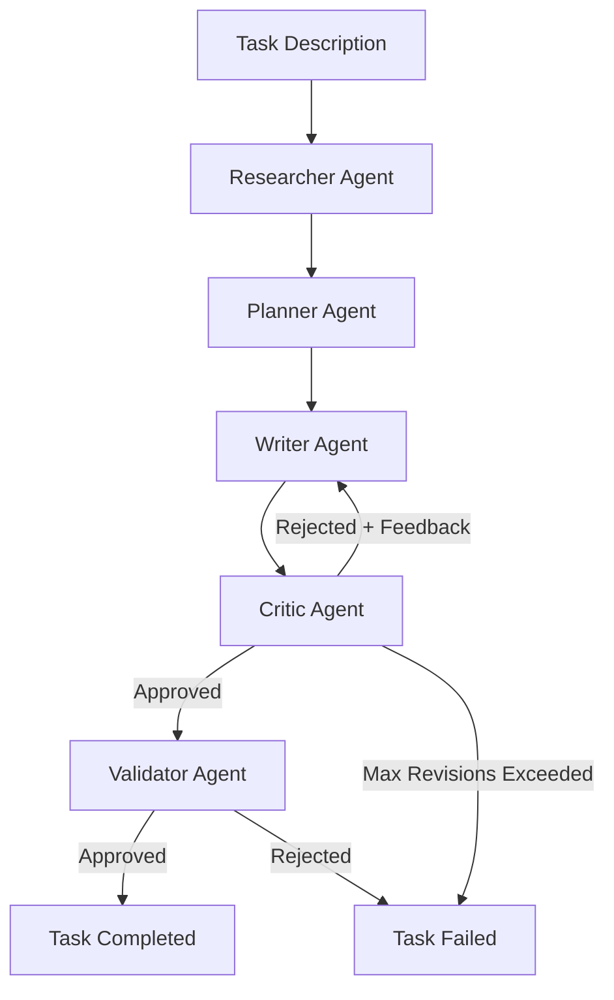
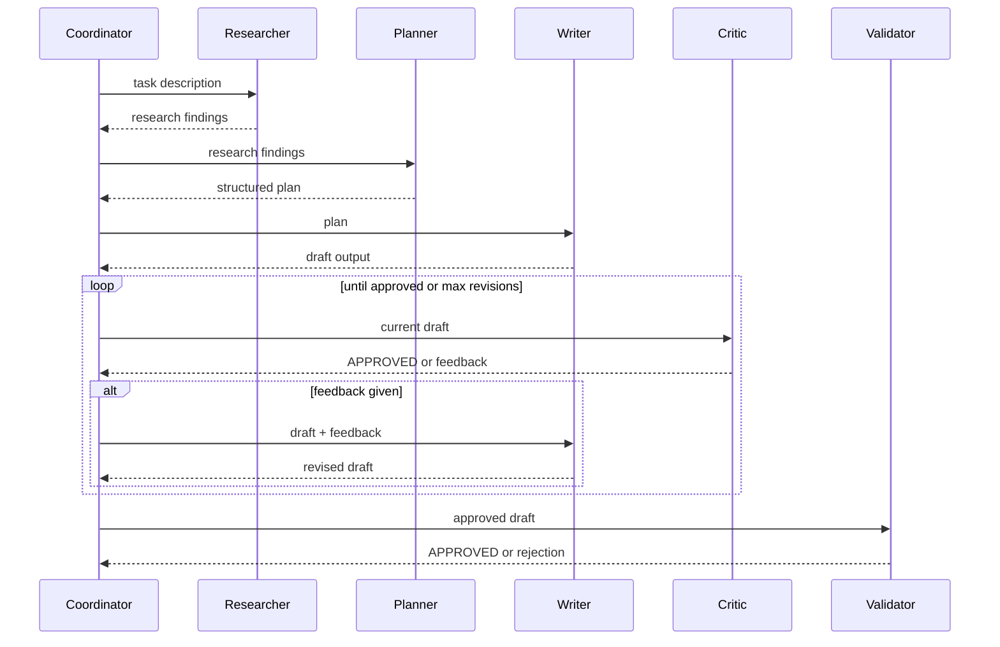
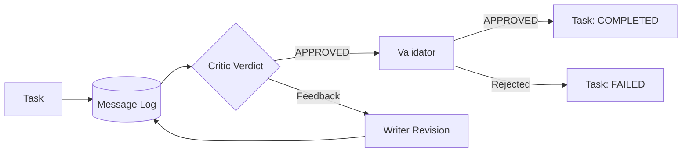

# Multi-Agent AI Collaboration Framework

**Part of the [AI Systems Portfolio](https://github.com/DayanGillani/dayan-gillani) ecosystem**

## 1. Executive Summary

A framework for coordinating specialized AI agents through a fixed pipeline with an explicit critique-and-revision loop. Rather than one large prompt trying to do everything, work is split across roles — research, planning, writing, critique, validation — each with a narrow responsibility, connected through a message-passing coordinator.

## 2. Problem Statement

Single-prompt AI systems tend to conflate several jobs into one call: gather information, structure it, produce output, and judge whether the output is good — all in one shot, with no mechanism to catch and correct a weak first attempt. When the output is wrong, there's no structured way to say *why* and try again; you just re-prompt and hope.

## 3. Business Value

- Produces a traceable audit trail: every agent's input and output is logged as a message, so a bad final result can be traced back to which stage introduced the problem
- Encodes revision as a first-class workflow step, not an afterthought — output quality improves through a bounded critique loop instead of a single pass
- Each agent role is independently swappable and testable — improving the critic's judgment doesn't require touching the writer

## 4. Key Features

- Fixed five-stage pipeline: Research → Plan → Write → Critique → Validate
- Bounded critique/revision loop (configurable max retries, defaults to 3) that prevents infinite agent disagreement
- Full message log per task, reconstructable into a complete conversation history
- Agents are dependency-injected functions — orchestration logic is fully testable without any real LLM calls

## 5. System Architecture



## 6. Workflow Design



## 7. Prompt Engineering Strategy

Each agent's handler receives two things: the input text for its specific job, and the full prior message list for context. This keeps prompts role-scoped — the writer's prompt is about writing, not about also being told to judge its own quality — while still giving every agent access to full conversation history if it needs it.

## 8. Context Engineering Strategy

Context accumulates as an explicit, typed list of `AgentMessage` objects rather than a growing string. This means any agent (or a future logging/debugging tool) can filter, search, or summarize the conversation history by type (request vs. critique vs. approval) without string parsing.

## 9. Data Flow



## 10. Example Use Cases

- Content generation pipelines where a first draft reliably needs at least one revision pass
- Any workflow where "did this pass review" needs to be a structured decision, not an implicit judgment buried in a single LLM call
- Prototyping multi-step agent workflows before committing to a specific LLM provider — the orchestration logic here is provider-agnostic by design

## 11. Screenshots Section

_Not applicable — this is a backend orchestration library with no UI._

## 12. Architecture Diagrams

See Section 5 (System Architecture) and Section 9 (Data Flow).

## 13. Agent Flow Diagrams

See Section 6 (Workflow Design) — the sequence diagram shows the full agent handoff and revision loop.

## 14. Context Flow Diagram

See Section 9 (Data Flow).

## 15. Installation Guide

```bash
git clone https://github.com/DayanGillani/multi-agent-ai-collaboration-framework.git
cd multi-agent-ai-collaboration-framework
pip install -r requirements.txt
```

**Run the test suite** (24 tests, including the critique/revision loop logic):

```bash
python -m pytest tests/ -v
```

**Run the end-to-end demo** (simulates a first draft being rejected, revised, and approved):

```bash
python examples/demo.py
```

No API key required — agent "thinking" is simulated with deterministic functions so the orchestration logic can be verified independently of any LLM provider.

## 16. Future Roadmap

**Implemented:**
- [x] Agent abstraction with dependency-injected handlers
- [x] Five-role pipeline (researcher, planner, writer, critic, validator)
- [x] Bounded critique/revision loop with configurable max retries
- [x] Full message-log audit trail per task
- [x] 24-test suite covering models, agents, and orchestration logic
- [x] Working end-to-end demo showing a real rejection → revision → approval cycle

**Not yet implemented — honest gaps:**
- [ ] Real LLM-backed agent handlers — current handlers are deterministic Python functions for demo/testing purposes
- [ ] Dynamic routing — the pipeline is a fixed sequence, not an LLM-decided agent graph (a deliberate scoping choice, documented as a trade-off in `coordinator.py`)
- [ ] Parallel agent execution — all agents currently run sequentially; there's no fan-out/fan-in support yet
- [ ] Persistence — message logs and task state exist only in memory for the duration of a `Coordinator.run()` call
- [ ] Integration with the Adaptive Context Memory CRM (companion repo) so agents could draw on stored customer context

## 17. Repository Structure

```
multi-agent-ai-collaboration-framework/
├── README.md
├── requirements.txt
├── docs/
├── screenshots/
├── architecture/
├── prompts/
├── examples/
│   └── demo.py              # Working end-to-end demo with a real revision cycle
├── src/
│   ├── __init__.py          # Public API exports
│   ├── message.py           # AgentMessage, MessageType
│   ├── task.py               # Task, TaskStatus
│   ├── agent.py              # Agent base class + role factories
│   └── coordinator.py        # Pipeline orchestration + critique loop
└── tests/
    ├── test_message_and_task.py
    ├── test_agent.py
    └── test_coordinator.py
```

---

*This project is part of a connected AI Systems Portfolio. See the [profile](https://github.com/DayanGillani) for the full ecosystem roadmap.*
